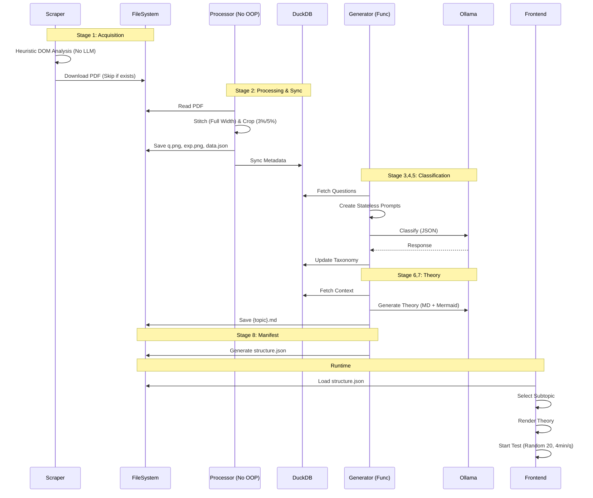

# LibrEd

**LibrEd** is a purely local, containerized, and agent-driven platform for exam preparation. It combines a modern React frontend with an autonomous backend pipeline that scrapes, classifies, and generates study materials from raw syllabus PDFs and local LLMs.

Live: https://dontcompete.vercel.app

## Core Philosophy & Features

*   **100% Local & Private**: All data processing and AI generation happens on your machine using Ollama. No external APIs, no cloud dependencies.
*   **Container-First Architecture**: The entire system runs via Docker Compose. No local Python or Node.js environment setup required.
*   **Functional Asset Generator**:
    *   **Sequential Pipeline**: 8-stage functional sequence (Download -> OCR -> DB Sync -> Classification -> Theory -> Manifest).
    *   **Deterministic**: Heuristic Parsing ensures high-fidelity image extraction for questions and explanations.
    *   **Idempotent**: Re-runs extend existing datasets instead of reclaiming them.
*   **Modern Modular Interface**:
    *   **Modular Shell**: Minimal root layout delegating logic to specialized, reusable components.
    *   **Adaptive Assessment**: Handles MCQ, MSQ, and Numeric inputs with real-time validation.
    *   **Dynamic Navigation**: URI-based breadcrumbs and stateful dashboard expansion.

## Possible Improvements and prototype ideas (during GSoC)

- [ ] OCR doesn't work well on different colors and some scenarios.
- [ ] LLaMA 3.1 isn't accurate enough.
- [ ] Duplicate handling in topic classification is a bit too strict.
- [ ] Consider shifting knowledge generation fully to TypeScript?
- [ ] Improve performance on CPU.
- [ ] Platform is currently exam-specific; could be generalized.
- [ ] Shift to asynchronous operations where viable.
- [ ] Shift to better official sources for PYQs and answer-keys, generate explanation with LLM. (Currently the project relies on GateAcademy's explainations which we dont want to rely on)
- [ ] A system to generate a study plan based on previous year question patterns. (For example, based on previous year question patterns and topic frequency, generate a list of topics to study in order)
- [ ] Re-evaluate the decision of shifting away from LFS, it'll likely be needed for assets.

---

## CLI Dataset Generator

You can generate datasets from PDFs using the command line interface.

Example:

python generator/cli.py --pdf input.pdf --output dataset/

Arguments:

--pdf     Path to the input PDF file
--output  Directory where generated images will be saved

## Getting Started

### Prerequisites
*   [Docker Desktop](https://docs.docker.com/get-docker/) or Docker Engine + Compose.
*   [Git](https://git-scm.com/).

### Quick Start
1.  **Clone the repository**:
    ```bash
    git clone https://github.com/AOSSIE-Org/LibrEd.git
    cd LibrEd
    ```

2.  **Launch the System**:
    ```bash
    docker compose up --build
    ```
    *   **Frontend**: Accessible at `http://localhost:3000`.
    *   **Generator**: Autonomously populates content in the background.
    *   **Idempotency**: Existing data is skipped; re-launching only processes new or missing streams.

3.  **Monitor Pipeline**:
    ```bash
    docker compose logs -f generator
    ```

### Configuration
Central configuration is managed in `generator/src/config.py`. You can customize:
*   `TARGET_STREAMS`: Which exam streams to process (e.g., CS, DA).
*   `OLLAMA_MODEL`: The local LLM to use (default: `llama3.1`).

---

## System Architecture

The system is split into two autonomous components that communicate via shared file-system artifacts:

1.  **Asset Generator (`/generator`)**: A functional Python pipeline using DuckDB, PyMuPDF, `tenacity` (retries), and Ollama.
2.  **Frontend (`/frontend`)**: A high-performance React application (Vite, TanStack Router) that **dynamically discovers** generated static assets via filesystem structure (Zero-Config discovery).

### Data Pipeline: Detailed Components & Flows

The generator (`generator/src/main.py`) runs a sequential, atomic pipeline.

#### Stage 1: Acquisition (Scraping)
**Component**: `ScraperEngine` (`scraper_engine.py`) using **Playwright**.
*   **Constraint**: **LLMs are explicitly NOT used** for detection/downloading. Logic must be procedural/heuristic.
*   **Logic**:
    1.  **Syllabus**: Visit `/syllabus/{stream}` -> Find year page -> Extract PDF link.
    2.  **PYQs**: Visit `/py-papers` -> Filter by stream slug -> Iterate years -> Extract PDF links.
*   **Optimization**: Skips re-downloading if file exists in `data/raw/`.

#### Stage 2: Processing (Ingestion)
**Component**: `pdf_utils.py` using **PyMuPDF (fitz)** and **Pillow**.
*   **State Machine**:
    *   `START` -> `Question \d+` -> `QUESTION`
    *   `QUESTION` -> `Ans.` -> `ANSWER`
    *   `ANSWER` -> `Sol.` -> `EXPLANATION`
*   **Image Stitching**:
    *   **Full Width**: Captures full content width.
    *   **Vertical Merge**: Merges multi-page segments into single `q.png`/`exp.png`.
*   **Validation**: Image extraction occurs **only** when valid boundaries are detected.

#### Stage 3: AI Analysis (Syllabus Parsing)
**Component**: `knowledge_utils.py` + `SyllabusParser`
*   **Input**: Syllabus PDFs from Stage 1.
*   **Prompt**: Extracts structured hierarchy (Subjects -> Subtopics) from raw PDF text.
*   **Output**: Populates `subjects` and `subtopics` tables (idempotent).
*   **Constraint**: Must run *before* Question Classification.

#### Stage 4: AI Analysis (Classification)
**Component**: `knowledge_utils.py` + `prompt_utils.py` + **Ollama**.

##### Prompt Generation
*   **Stateless**: Prompts must be self-contained within context window.
*   **Input**: Syllabus Database + Batch of Questions (default 5).
*   **Task**: Map Question ID -> Subject -> Subtopic.
*   **Handling Unknowns**: Maps "Other" to "General Aptitude" -> "Miscellaneous".

##### LLM Processing
*   **Orchestration**: Sequential/Batched execution to handle local resource limits.
*   **Output**: JSON-only response parsed and synced to `questions` table.

#### Stage 5: AI Analysis (Theory Generation)
For each Subtopic with > 0 questions:
*   **Prompt**: Includes existing theory and all questions as context to determine depth/scope.
*   **Output**: Markdown with Mermaid diagrams (`graph LR`, etc.) and KaTeX math.
*   **Update Rule**: Updates existing files only if there's something new to add.

#### Stage 6: Manifest Generation (Export)
**Component**: `knowledge_utils.generate_manifest` (Per-Stream)
*   **No Global Registry**: Does *not* generate a global `exams.json` or `info.json`. Discovery is purely filesystem-based.
*   **Output**: Generates `structure.json` inside each stream's folder.
*   **Copy/Linking**: Ensures all referenced images exist in `frontend/assets`.

#### Stage 7: Auditing
Users can improve the generated notes, and LLMs would use it as a reference.

---

### Database Schema (DuckDB)
The system uses **DuckDB** (`data/app.duckdb`) as an intermediate relational store.

| Table | Column | Type | Description |
| :--- | :--- | :--- | :--- |
| **questions** | `id` | VARCHAR | Global composite ID (`{stream}_{packet}_{qno}`) |
| | `stream_code` | VARCHAR | e.g., `computer-science-information-technology` |
| | `packet_id` | VARCHAR | Source PDF identifier (e.g., `2024-M`) |
| | `question_no` | VARCHAR | e.g., `1`, `55` |
| | `q_type` | VARCHAR | `MCQ`, `MSQ`, `NAT` |
| | `q_key` | VARCHAR | Answer Key (e.g. `A`, `55.2`) |
| | `q_text` | TEXT | Extracted text of question |
| | `a_text` | TEXT | Extracted text of answer |
| | `exp_text` | TEXT | Extracted text of explanation |
| | `subtopic_id` | VARCHAR | FK to `subtopics.id`. Populated by LLM. |
| | `img_path_q` | VARCHAR | Relative path to question image |
| | `img_path_exp` | VARCHAR | Relative path to explanation image |
| **subjects** | `id` | VARCHAR | e.g., `cs_subj_1` |
| | `name` | VARCHAR | e.g., `Digital Logic` |
| **subtopics** | `id` | VARCHAR | e.g., `cs_subj_1_topic_3` |
| | `subject_id` | VARCHAR | FK to `subjects.id` |
| | `name` | VARCHAR | e.g., `Minimization` |
| **theory** | `id` | VARCHAR | e.g., `theory_cs_subj_1_topic_3` |
| | `subtopic_id` | VARCHAR | FK to `subtopics.id` |
| | `content_md` | TEXT | Generated Markdown content |

---

### Frontend Architecture (React)

#### Tech Stack
*   **Framework**: TanStack Start / React (Vite).
*   **Styling**: Tailwind CSS + DaisyUI.
*   **Routing**: File-based (`@tanstack/react-router`).
*   **Linting**: Biome (No ESLint/Prettier).
*   **MDX**: `rehype-katex` and `mermaid` support.

#### Modular & Dynamic UI
*   **Modular Root Layout**: `__root.tsx` acts as a minimal structural shell, delegating specific behaviors to:
    *   `ThemeScript`: Injects a synchronous, blocking script into `<head>` to prevent Flash of Unstyled Content (FOUC).
    *   `GlobalBreadcrumbs`: Dynamically generates consistent navigation from URI path segments, avoiding hardcoded labels.
*   **Stateful Dashboard**: Uses query parameters (`?expanded=`) for targeted expansion while defaulting to "All Expanded" to maximize content visibility.

#### Assessment Logic
*   **Flow**: Stream -> Subject -> Subtopic -> Theory -> Assessment.
*   **Rules**:
    *   **Max 20 questions** per attempt (Randomized).
    *   **Time Limit**: **4 minutes per question**.
*   **Interaction**:
    *   **MCQ/MSQ/NAT**: Adaptive input fields.
    *   **Submission**: Correct -> Next; Incorrect -> Show Explanation.
*   **Rendering**:
    *   Theory: MDX with `rehype-katex` and `mermaid`.
    *   Placeholders: Code-based UI for missing artifacts.

---

### Data Contracts & Artifacts

#### Location
All frontend-consumable data resides in: `frontend/public/assets/gate/`

#### File Structure
```text
assets/gate/
└── cs/
    ├── structure.json
    ├── digital-logic/
    │   ├── boolean-algebra.md
    │   └── number-systems.md
    └── questions/
        └── 2024-M/
            └── 1/
                ├── q.png
                ├── exp.png
                └── data.json
```

---

### System Design Diagram



---

### Constraints

#### Execution & Environment
*   **No Local Installations**: Entire workflow must run via **Docker / Docker Compose**.
*   **Single-Entry Workflow**: Docker Compose runs both asset generation and frontend.
*   **Local & Private**: Relies entirely on local LLMs (Ollama) and local artifacts; **No remote API support**.

#### Data Integrity & Reusability
*   **Incremental & Idempotent**: Re-runs extend existing datasets instead of recreating them.
*   **Reusability-First**: Existing PDFs, databases, and artifacts must be reused.
*   **Single Source of Truth**: All derived data must be traceable to original PDFs.
*   **Robust Prompting**: Prompts must be self-contained (stateless) and designed to fit within model context windows.
*   **No Hardcoded Values**: Architecture should minimize hardcoded values, unless module-specific.

#### Performance & Safety
*   **Skip Re-downloading**: Do not download PDFs if they already exist.
*   **Safe DB Ops**: Use `INSERT OR IGNORE`/`REPLACE` to maintain idempotency.
*   **Valid Extraction**: Image extraction occurs **only** when valid boundaries are detected.

#### Non-Goals
*   Authentication, Cloud Deployment, Real-time collaboration, Analytics (beyond counts).

---

### Possible Improvements

* OCR doesn't work well on different colors and some scenarios.
* LLaMA 3.1 isn't accurate enough.
* Duplicate handling in topic classification is a bit too strict.
* Consider shifting knowledge generation fully to TypeScript?
* Edit markdown from frontend?
* Improve performance on CPU.
* Platform is currently exam-specific; could be generalized.
* Shift to asynchronous operations where viable.
* Shift to better sources for PYQs and answer-keys, generate explanation with LLM. (Currently the project relies on GateAcademy)
* Re-evaluate the decision of shifting away from LFS, it'll likely be needed.

---

## Contributing

We are building a free, high-quality platform for everyone, and we need your help to achieve that!

### Non-Coding Contributions
AI is a powerful accelerator, but it's not perfect. We rely on the community to ensure quality and depth.

*   **Improve Theories**: AI-generated explanations can be generic or miss nuance. If you have a better explanation, analogy, or diagram for a concept, please submit a PR!
*   **Quality Assurance**:
    *   **Review**: Help us verify the correctness of questions and answers in Pull Requests.
    *   **Model Testing**: Run the generator with different LLMs (Mistral, Gemma, Phi-3, or larger parameter models on your local machine) and report which yields the best results.
*   **Community Questions**: Identify gaps in our question bank and add commonly asked questions or "gotchas" for specific topics.
*   **Expand Scope**: PRs adding support for **other competitive exams** are highly welcome! Let's build a universal free platform together.

### Testing
The project includes a comprehensive test suite that runs in Docker.

**1. Generator Tests (Backend)**
```bash
docker compose run --rm asset-generator pytest generator/tests
```

**2. Frontend Tests (Playwright)**
Run the end-to-end tests using the official Playwright container:
```bash
docker run --rm --network gatebuster_app_network -e BASE_URL=http://frontend:3000 -v "$(pwd)/frontend:/app" -w /app mcr.microsoft.com/playwright:v1.58.0-jammy sh -c "npm install && npx playwright test"
```
*Note: Ensure the frontend service is running (`docker compose up`) before starting Playwright tests.*

## License
Apache 2.0 License - see `LICENSE` for details.
